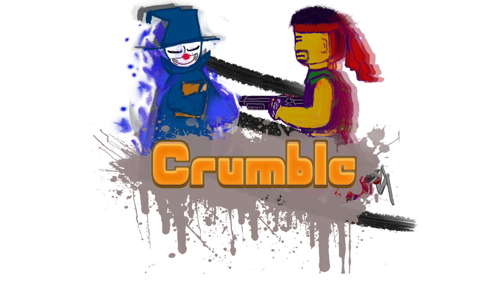
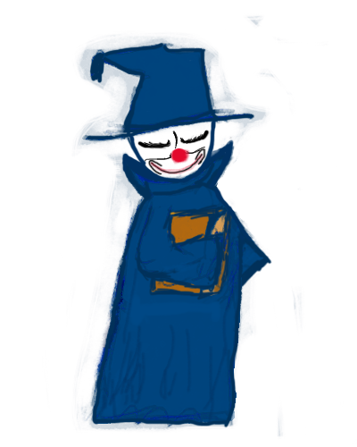
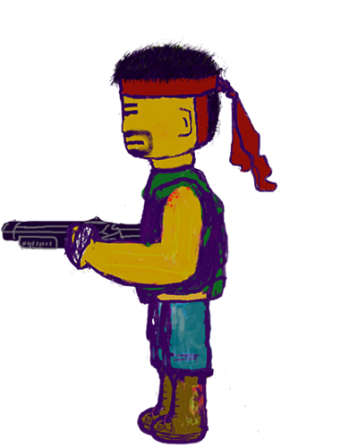

# Crumble

HTML+JavaScript编写的双人格斗类本地网页游戏，目前有法术巫师和手持散弹枪的机械师两名角色，每个角色拥有自己专属技能和大招

# 角色:

## 法师：3800HP
**Ｈ**：法力凝聚；永久增加10%基础属性，可叠加，13s CD, 0.5s咏唱时间

**Ｊ**：平A；魔焰射线；向正前方发射一条长300px的射线，180点瞬间伤害0.5s攻击速度

**Ｋ**：魔障：为自身释放一个持续2.8s的护盾，最多可以吸收400点伤害，在后2s内逐渐衰减 8sCD

**Ｌ**：炎爆术；向正前方释放一个火球，咏唱越久伤害越高，火球越大（最高秒杀，最低50点），咏唱时移动速度减半，12s CD

**大招**：替身：创造出一个替身并给自身提供2000HP护甲，2500HP，会向敌人投掷微型火球，200HP伤害，1.5sCD;替身每存在1s，就为本体恢复60hp，

## 枪械师：4000HP
**Ｈ**:血祭：增加50%全属性和减少100%的攻击速度，持续3秒， 8s CD，消耗120点生命值

**Ｊ**：平A：射击；向正前方200px射击，造成1~200点瞬间伤害，0.3s攻击速度

**Ｋ**:突进：突进至正前方4个单位，无视碰撞，1.2sCD；

**Ｌ**：微型核弹：向目标发射一颗微型核弹，距离越远伤害越高，速度越快

**大招**：Allahu Trapbar:释放3个恐怖机器人，向目标快速移动，碰到目标后爆炸，每个机器人造成800点伤害，机器人可被击毁
